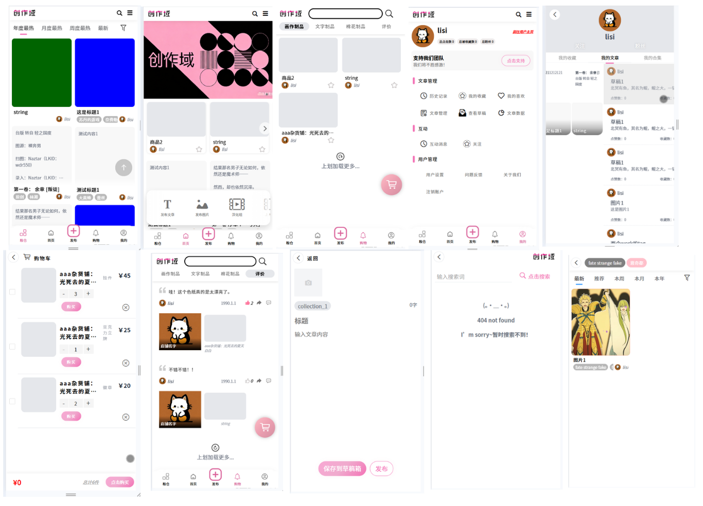
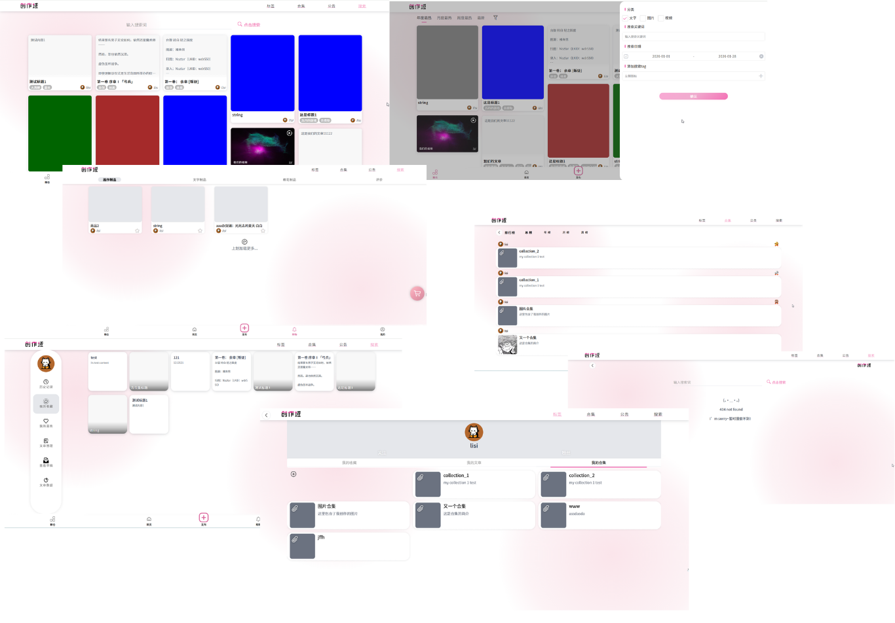

# SecondCreationV1

基于 uni-app + Vue 3 的二次元同人创作平台前端，支持 H5 与多端小程序构建（目前主要适配 H5）。

**后端仓库**
`https://github.com/black-waters-z/SecondCreationBackend-V1/tree/feat/v2`

**在线环境说明**
`.env.development` 默认指向本地后端（`http://localhost:8080`），可按需切换为线上或局域网地址。

## 功能概览

- 首页信息流与推荐
- 文章/帖子详情、评论与收藏
- 标签导航与分区页
- 搜索与热榜/收藏榜
- 发布入口与投稿流程（中间发布按钮）
- 用户登录、个人中心与通知
- 商城/商品详情、购物车与评价
- AI 玩法页面（`aiPlay`）

## 技术栈

- 框架：`uni-app` + `Vue 3` + `TypeScript`
- 状态管理：`Pinia`
- UI：`uview-plus` / `uni-ui` / `Element Plus (H5)`
- 构建：`Vite`

## 快速开始

1. 安装依赖

```bash
npm i -g pnpm
pnpm install
```

2. 启动 H5 开发

```bash
pnpm run dev:h5
```

## 其他常用脚本

```bash
# 小程序/多端开发（按需替换平台）
pnpm run dev:mp-weixin
pnpm run dev:mp-alipay

# H5 构建
pnpm run build:h5

# 类型检查与 Lint
pnpm run type-check
pnpm run lint
```

## 环境变量

`.env.development`

```env
VITE_API_BASE=http://localhost:8080
VITE_IMAGE_BASE=http://localhost:8080/static/upload_IMG/
VITE_VIDEO_BASE=http://localhost:8080/static/upload_Video/
VITE_STATIC_IMG_BASE=http://localhost:8080/static/asset/
```

## 目录结构（节选）

- `src/api`：接口封装
- `src/pages`：页面（首页、文章、标签、商城、用户等）
- `src/store`：Pinia 状态
- `src/components`：通用组件
- `src/static`：静态资源

## 页面展示





## 备注

- 小程序端尚未完全适配，优先使用 H5 体验。
